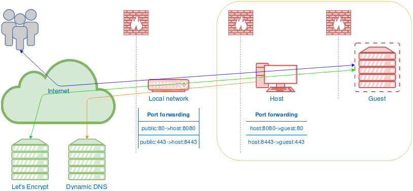

# vagrantp
#### Assignment

Create a repository on BitBucket or GitHub with the following:

  - A Vagrantfile for managing a VM with a Linux-based OS of your choice. Use a publicly available box.
  - A provisioner (Ansible, Chef, Puppet, Salt) to manage the configuration of the services in the Vagrantfile.
  - Provisioned services:
    - HAProxy
        - Configure SSL termination on frontend
        - Create a self-signed certificate or use LetsEncrypt, also document the commands you are using to create the certificate
        - Use TLS only
        - Use strong ciphers only
        - Generate a DH key and enable dhparam, also document the commands you are using to create a dh key
        - Enable HSTS
        - Enable OCSP Stapling
        - Send traffic to nginx SSL backend
    - nginx
        - Enable HTTPS
        - Enable Nginx Microcaching and make sure Cache is not enabled in Admin Area and for logged in users
        - Add any other configuration you may think is important (headers, deny access to important files and folders, ...)
    - php-fpm
        - For process management: choose either static, on demand, dynamic, also explain your decision
        - Listen directive: choose either Socket or TCP, also explain your decision
        - Add any other configuration you may think is important (number of workers, timeout, …)
    - Redis
        - Create a Timer Unit File to execute a self written script by yourself (bash, python, ..) every 5 minutes to load some dummy data into Redis (can be simple key/value i.e. hello/world)
    - MySQL
  - Create a simple website to serve with php-fpm that displays the string 'Hello World'
  - Write your explanations and documentations into the Readme

#### Solution

Before using this solution, you should have vagrant with a working provider installed. Visit [Getting Started](https://www.vagrantup.com/intro/getting-started/index.html) in Vagrant documentation for more info. A working Internet connection is also required.  
Provisioner is developed and tested in this network topology:  


This solution was developed on bare metal host using Fedora 26 Workstation with vagrant (1.9.1), qemu-kvm (2.9.1), libvirt (3.2.1) and ansible (2.4.2). It wasn't tested with Oracle's VirtualBox.
Ansible provisioner is written for CentOS 7 with packages from Base and EPEL repositories. Provisioner is based on [Ansible best practices repository](https://github.com/ansible/ansible-examples).

Edit group_vars/all file to suit your needs before provisioning the box.

Usage:
```shell
$ git clone https://github.com/iperovic/vagrantp
$ cd vagrantp
$ vi group_vars/all
$ vagrant init centos/7
$ vagrant up
```

Additional comments
- Certificate management  
  For simplicity, we use the same certificate for frontend and backend. Considering that backend isn't exposed, it doesn't make much difference.  
  Free [LetsEncrypt certificate authority](https://letsencrypt.org/about/) is used for certificate issuing.  
  At first we generate 2048bit RSA private key and CSR using Ansible openssl modules. This key size should be a good balance between encryption strength and server CPU usage for everyday use. We also generate a 4096bit private key for LetsEncrypt account. Haveged daemon is installed in order to increase available entropy for key generation.  
  First run of Ansible letsencrypt module requests a certificate and receives a challenge. In order to obtain the certificate, a challenge must be completed to prove your control over the specified domain. We chose to complete [http-01 challenge](https://ietf-wg-acme.github.io/acme/draft-ietf-acme-acme.html#rfc.section.8.3). Challenge data is written in specific hidden directory on nginx root. Second run of Ansible letsencrypt module receives the certificate. We concatenate intermediate issuer certificate to that file and use it with nginx. Parameters for Diffie–Hellman key exchange are generated using shell call to openssl with 2048bit size. It should be of same size as your private key.  
  Same certificate is used for HAProxy, only from one PEM file containing private key, public certificate, intermediate issuer certificate and DH parameters. PEM name dictates names of issuer certificate and OCSP response files which are also generated.  
  LetsEncrypt certificate issuing is done on LetsEncrypt staging environment on purpose. I believe you shouldn't unnecessarily encumber a free service if you're just toying around. Certificates issued on staging are just as good, only not trusted by default on your browser. SSL Labs will give it a T rating, but results also contain the rating site would receive if trust issues were ignored.  
  Using this playbook to issue production LetsEncrypt certificates is as simple as adding correct URL parameter for LetsEncrypt module. If you do that, don't forget to change URL for OCSP stapling support. Some versions of guest OpenSSL tools could require a slight change of syntax.
- HAProxy  
  HAProxy is configured for SSL termination with prepared certificate bundle. Configuration is based on Mozilla SSL Configuration Generator for modern profile. It will enable only strong ciphers at the expense of compatibility. OCSP stapling is configured. Should you want to use this for more than testing, OCSP response should be periodically updated. Communication with backend is also SSL based.
- nginx  
  Nginx is first used to complete the challenge for certificate issuing. After we obtain the certificate, nginx is reconfigured to serve the backend. SSL settings are based on Mozilla SSL Configuration Generator for intermediate profile. There are also common security related headers adjustments. As requested by the assignment, we use fastcgi micro caching with a few deliberate exclusions and deny access to hidden files. Role should be reusable for standard installations, only change the listening ports.
- php-fpm  
  Unix socket was chosen for accepting FastCGI requests. Nginx and php-fpm are on the same server so we'll gain a little speed and security. Dynamic process manager control was chosen due to being a good balance between speed and resource consumption on a machine with multiple services. Static would be a better choice to get maximum performance.  
  Process manager configuration should be tailored to server resources and content to get best results.
- Redis  
  Redis is installed with default configuration. Timer job is written purely in bash due to ambiguity of the assignment. And just for kicks. It may be simpler to use redis-cmd, netcat or similar tool. If you expose redis outside the server, you should seriously consider adding some security.
- MySQL  
  No databases or users are created. Only minimal security setup equivalent to running mysql_secure_installation. Root password is set from variable defined in group_vars. MariaDB is replacement for Oracle's MySQL on RHEL/CentOS.
- Ansible Provisioner  
  The whole pack could use some more tuning for each role to be independently reusable.  
  You should not store any real passwords in playbook files without using Ansible Vault.  
  Some additional info is in the comments of playbook and configuration files.
